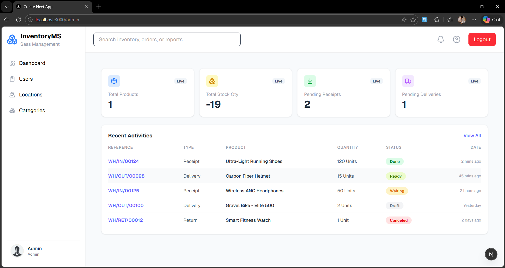
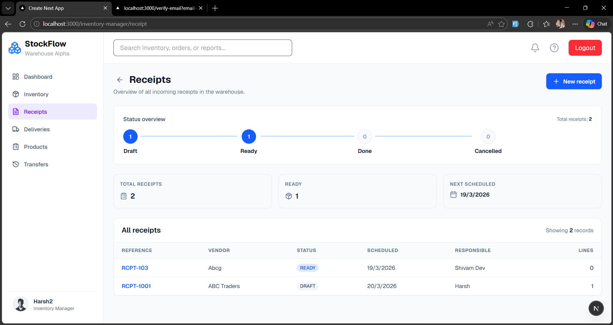
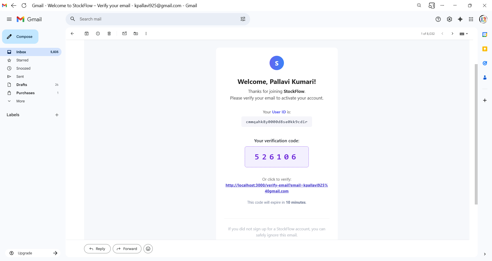

# StockFlow

StockFlow is a role-based inventory and warehouse management system built with Next.js, Prisma, PostgreSQL, and React Query.

## Highlights

- Role-based dashboards:
  - Admin
  - Inventory Manager
  - Warehouse Staff
- User invitation with email verification (OTP flow)
- Product, category, location, receipt, delivery, and stock-move management
- Session-based authentication and protected dashboard routes
- Global search support across dashboard data pages
- CSV export support on key listing pages

## Tech Stack

- Next.js 16 (App Router)
- React 19
- TypeScript
- Tailwind CSS 4
- Prisma ORM 7
- PostgreSQL
- React Query
- React Hook Form
- Nodemailer

## Project Structure

```text
app/
  (auth)/
  (dashboard)/
    admin/
    inventory-manager/
    warehouse-staff/
  api/
components/
hooks/
lib/
prisma/
public/
```

## Setup

### 1. Install dependencies

```bash
npm install
```

### 2. Configure environment variables

Copy `.example.env` to `.env` (or `.env.local`) and fill values.

Required keys:

- `DATABASE_URL`
- `SESSION_SECRET`
- `SMTP_HOST`
- `SMTP_PORT`
- `SMTP_SECURE`
- `SMTP_USER`
- `SMTP_PASS`
- `SMTP_FROM`
- `NEXT_PUBLIC_APP_URL`

### 3. Prepare database

```bash
npx prisma migrate dev
npx prisma generate
```

### 4. Run development server

```bash
npm run dev
```

App runs at http://localhost:3000

## Available Scripts

- `npm run dev` - start development server
- `npm run build` - create production build
- `npm run start` - run production server
- `npm run lint` - run ESLint

## Screenshots

Add your screenshots to:

- `public/screenshots/`

Then update or keep the sample links below.

### Admin Dashboard



### Inventory Manager Dashboard



### Gmail OTP




## How To Add More Screenshots

1. Put image files inside `public/screenshots/`.
2. Use markdown image syntax in this README:

```md

```

3. Commit both the image and README updates.

## Notes

- Keep `SESSION_SECRET` strong (at least 32 chars).
- Do not commit real production credentials.
- Configure SMTP properly to enable OTP and invite emails.

## License

MIT

